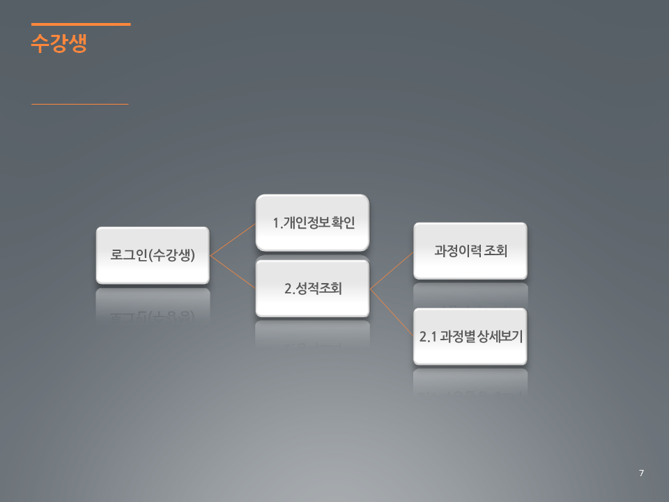

쌍용 교육센터 Java&Python 기반 응용SW개발자 양성과정 (기간 : 2017년 11년 1일 ~ 2018년 6월 1일)

## Oracle 데이터베이스를 활용한 JDBC 성적 관리 프로그램

* 기간 : 2018/02/01 ~ 2018/02/23 (설 연휴 휴강)
* 환경 : 콘솔 기반
* 주제 : 성적 관리 프로그램 (수강생, 관리자, 강사)
* 기술 : JavaSE , OOP, Collection, Generic, JDBC, Oracle, sqldeveloper
* 진행절차 : (DB구축부문) DB 개념적 모델링(엔터티, 속성, 도메인, 관계 ) -> 논리적 모델링(스키마 구성) → 물리적 모델링(Oracle DB에 테이블 저장)
* 진행절차 : (개발부문) 화면 설계 -> 자료구조 설계 → 액션 설계 → 액션 구현 → 테스트 - 최종실행

### 프로젝트 개요

##### 관리자

* 관리자는 수강생, 강사에 대한 정보 관리 · 과정 · 과목 · 강의실 · 교재를 관리 할 수 있고, 개설 과정 · 과목 의 추가, 삭제가 가능하며 수강생의 성적을 조회할 수 있다.

##### 강사

* 강사는 본인의 개인 정보 확인, 스케줄 조회, 시험(배점), 수강생의 성적을 관리 할 수 있다.

##### 수강생

* 수강생은 본인의 개인정보 확인, 성적 조회, 과정의 상세보기가 가능하다.

### 주요 참여 내용 (강사 로그인 메뉴 전부, 주요 로직 코드는 [여기](https://github.com/youmekko/sist-2nd-project-sistmng/blob/master/src/com/sistmng/instructor/InstructorDAO.java)) 

### 강사 메뉴 구현 화면

### DB 스키마

### 화면 흐름

### Class 다이어그램

